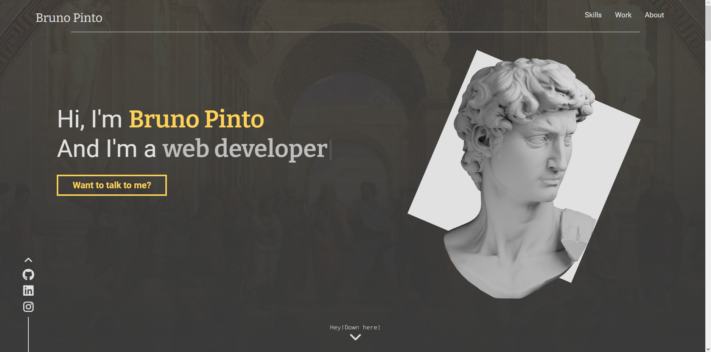
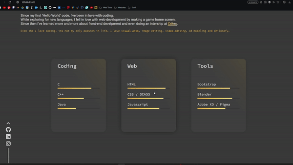
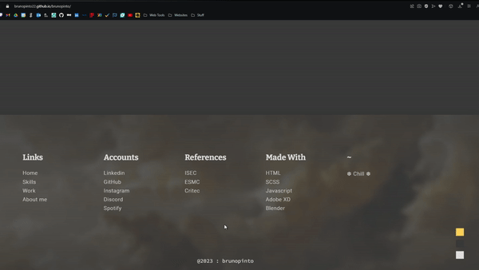

# Bruno Pinto's Personal Portfolio
     

---
 
 
 

# EasterEggs 🐰
 

* Changing Avatar

###### By cliking 12 times the Avatar it changes to a diferent one.

 
 

* First Web Page
  

 
 
 

* Blender Animation

 
 
 

* Alternative Photo

 
 
 

*  Check out Art account

 
 
 

# Extras 

* Copy color code

###### By cliking the color block in the footer you'll get the color HEX code